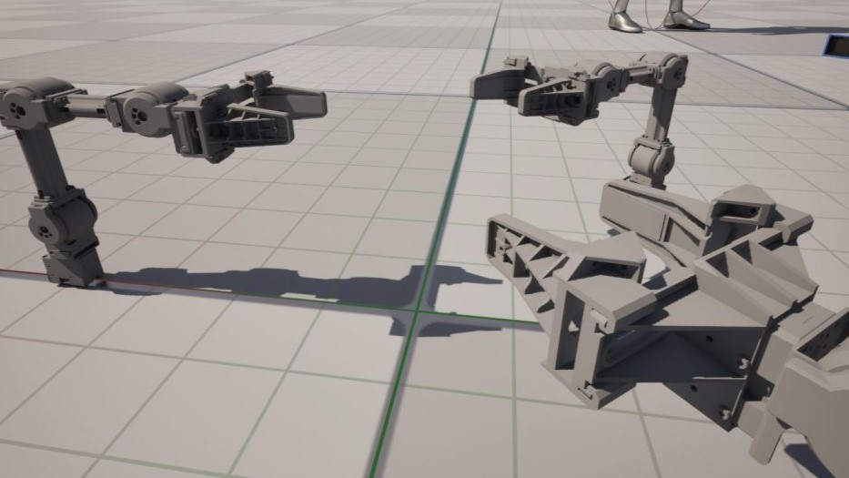
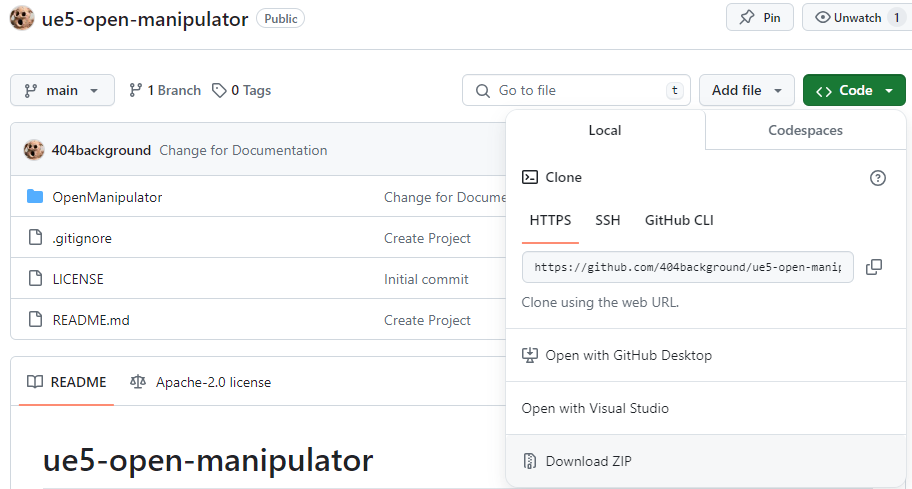
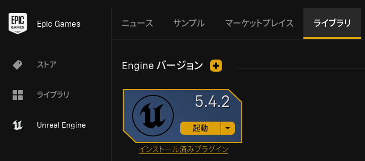
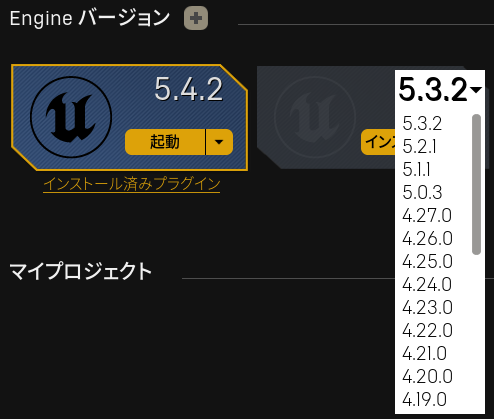
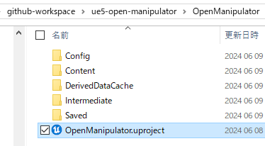
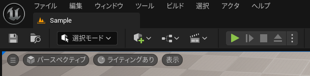
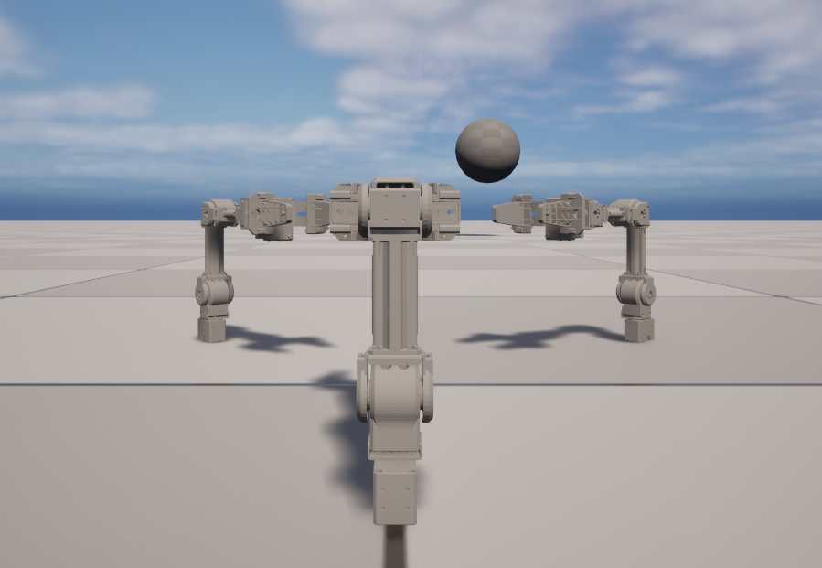
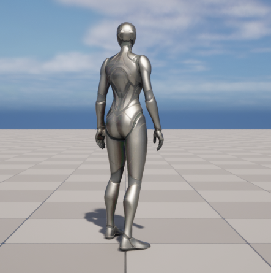

# ue5-open-manipulator

Open Manipulator Blueprint for Unrael Engine 5

## Overview

This is sample of Open Manipulator created for Unreal Engine 5.  
Click on the image below to play the video.  
  

This sample uses Open Manipulator STL files.  
<https://github.com/ROBOTIS-GIT/open_manipulator>  

## Test Case

Windows 10/11

- Unreal Engine 5.4.2

## How to use

1. Install this repository  
 Run the git clone command or download as a ZIP from GitHub repository.  
 The git clone command is as follows:  
 `git clone https://github.com/404background/ue5-open-manipulator.git`  
 If you want to download it as ZIP, select Code -> Download ZIP below.  
   

2. Check your Unreal Engine version  
 If you do not have Unreal Engine 5.4 installed in your library, please install it.  
   
 Enter the plus button and choose the version.  
   

3. Run the uproject file  
 You will find the uproject file in the OpenManipulator folder.  
 Please execute it.  
   

4. Start and Possess Pawn classes  
 Please click the Start button.  
   
 If you type 1~3 on your keyboard, you possess an Open Manipulator.  
   
 If you type 0 on your keyboard, you possess a ThirdPersonCharacter.  
   

## Others

Creating a model of a 6-axis robot arm:  
<https://404background.com/ue5/unreal-engine-5-6/>  

Creating a model of this Open Manipulator:  
<https://404background.com/ue5/unreal-engine-5-7/>  
